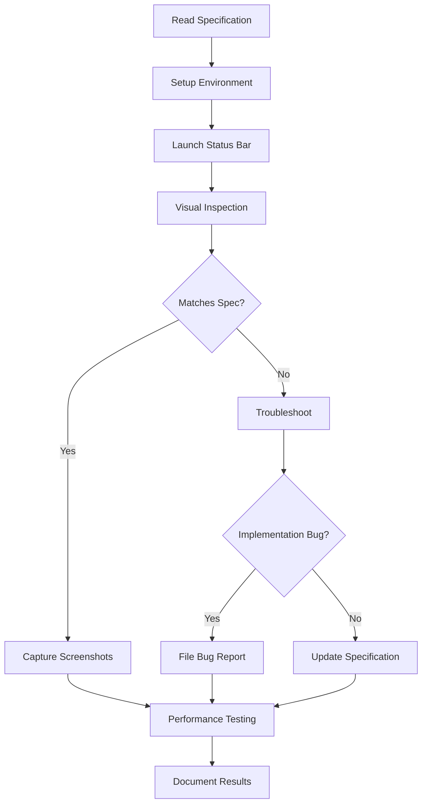

# Shine Visual Documentation Suite

## Overview

This directory contains comprehensive visual state documentation for the Shine status bar application, created to support systematic testing and debugging of the TUI interface.

## Documents

### 1. Visual State Specification (`VISUAL_STATE_SPECIFICATION.md`)

**Purpose:** Complete technical specification of the status bar's expected visual appearance

**Contents:**
- Overall layout and positioning details
- Component breakdown (workspaces, spacer, clock)
- Color scheme with ANSI codes
- Dynamic behavior and update intervals
- Technical implementation details
- Configuration options reference
- ASCII mockups of expected appearance
- Comprehensive verification checklist

**Use Cases:**
- Reference for developers implementing features
- Baseline for visual regression testing
- Documentation for design decisions
- Troubleshooting visual issues

**Key Sections:**
- **Section 2:** Layout & Position - Exact dimensions and placement
- **Section 3:** Visual Components - What should be visible
- **Section 4:** Color Scheme - ANSI color codes and styling
- **Section 8:** Expected Visual Appearance - ASCII mockups
- **Section 9:** Verification Checklist - Testing checklist

### 2. Visual Testing Guide (`VISUAL_TESTING_GUIDE.md`)

**Purpose:** Practical guide for testing the status bar's visual state

**Contents:**
- Step-by-step testing workflow
- Visual inspection checklist
- Screenshot capture instructions
- Troubleshooting common issues
- Configuration variants to test
- Performance testing procedures
- Comparison methodology

**Use Cases:**
- QA testing procedures
- Developer self-testing
- Bug reproduction steps
- Regression testing
- Performance validation

**Key Sections:**
- **Section 3:** Visual Inspection Checklist - Quick verification
- **Section 5:** Screenshot Capture - Documentation workflow
- **Section 6:** Troubleshooting - Common problems and solutions
- **Section 8:** Testing Matrix - Comprehensive test coverage

## Quick Start

### For Developers

1. **Before Implementation:**
   - Read `VISUAL_STATE_SPECIFICATION.md` sections 2-4
   - Review code references in Appendix

2. **During Development:**
   - Follow `VISUAL_TESTING_GUIDE.md` section 2 (launch)
   - Use section 3 checklist for quick verification

3. **After Changes:**
   - Complete full testing workflow (guide section 1-8)
   - Capture screenshots for comparison
   - Update specification if behavior changed intentionally

### For Testers

1. **Initial Testing:**
   - Follow `VISUAL_TESTING_GUIDE.md` sections 1-5
   - Complete verification checklist
   - Capture baseline screenshots

2. **Regression Testing:**
   - Compare against specification
   - Use screenshot comparison workflow
   - Document deviations

3. **Bug Reporting:**
   - Reference specific specification sections
   - Include screenshots
   - Note configuration used

## Document Relationships

```
VISUAL_STATE_SPECIFICATION.md
  │
  ├─ Defines WHAT the bar should look like
  ├─ Defines HOW it should behave
  └─ Provides verification criteria
     │
     └─> VISUAL_TESTING_GUIDE.md
         │
         ├─ Explains HOW to verify specification
         ├─ Provides troubleshooting steps
         └─ Documents testing workflow
```

## Testing Workflow



## Key Metrics

The specification documents these measurable aspects:

| Aspect | Expected Value | Where Documented |
|--------|---------------|------------------|
| Height | 30 pixels | Spec Section 2.1 |
| Width | Full screen | Spec Section 2.1 |
| Update Rate | 1 second | Spec Section 5.1 |
| Active Color | ANSI 14 (Cyan) | Spec Section 4.2 |
| Clock Color | ANSI 13 (Magenta) | Spec Section 4.2 |
| CPU Usage | <1% idle | Guide Section 8 |
| Memory | <50MB | Guide Section 8 |

## Screenshot Reference

Recommended screenshots to capture:

1. **baseline-full-screen.png** - Entire screen with status bar
2. **baseline-bar-only.png** - Status bar isolated (0,0 1920x30)
3. **single-workspace.png** - One workspace active
4. **multi-workspace.png** - Multiple workspaces, workspace 2 active
5. **many-workspaces.png** - 10+ workspaces visible
6. **time-update.png** - Clock before/after update

Store in: `~/Pictures/Screenshots/shine-bar/`

## Code References

**Primary Source Files:**

1. **TUI Logic:** `/cmd/shine-bar/main.go`
   - View rendering (lines 116-167)
   - Styling (lines 119-134)
   - Data fetching (lines 170-202)

2. **Panel Config:** `/pkg/panel/config.go`
   - Edge/Layer definitions (lines 10-115)
   - Kitty integration (lines 234-428)

3. **Configuration:** `/pkg/config/types.go`
   - Bar config structure (lines 76-137)
   - Defaults (lines 266-280)

4. **Example Config:** `/examples/shine.toml`
   - Bar section (lines 32-57)

## Revision Strategy

### When to Update Documentation

**Update Specification When:**
- Visual design changes intentionally
- New features added to status bar
- Configuration options change
- Technical implementation changes significantly

**Update Testing Guide When:**
- New test scenarios identified
- Troubleshooting steps change
- Tools or commands change
- New testing methods introduced

**Both Documents When:**
- Major refactoring occurs
- Platform requirements change
- Color scheme updated

### Version Control

Both documents include revision history tables. When updating:

1. Increment version number
2. Add entry to revision history table
3. Update date stamps
4. Document what changed

## Future Enhancements

Potential additions to this documentation suite:

1. **Automated Visual Testing:**
   - Screenshot comparison scripts
   - CI/CD integration
   - Regression test automation

2. **Interactive Documentation:**
   - Embedded screenshots in specification
   - Video demonstrations
   - Interactive mockups

3. **Extended Coverage:**
   - Multi-monitor scenarios
   - Accessibility testing
   - Theme variant testing
   - Different compositor support

4. **Performance Benchmarks:**
   - Baseline performance metrics
   - Rendering performance tests
   - Memory leak detection

## Contributing

When contributing visual changes:

1. Read both documents completely
2. Make code changes
3. Run full testing workflow
4. Capture screenshots
5. Update specification if needed
6. Include screenshots in PR
7. Reference specification sections in commit messages

## Questions?

- **Visual appearance unclear?** → Check specification Section 8
- **Testing procedure unclear?** → Check testing guide Section 1
- **Configuration options?** → Check specification Section 7
- **Troubleshooting?** → Check testing guide Section 6
- **Code implementation?** → Check specification Appendix

## Document Status

- **VISUAL_STATE_SPECIFICATION.md:** v1.0 - APPROVED for Phase 2 Testing
- **VISUAL_TESTING_GUIDE.md:** v1.0 - READY for use
- **Created:** 2025-11-02
- **Branch:** phase-2-statusbar
- **Next Review:** After Phase 2 completion

---

**Maintainer:** Development Team
**Last Updated:** 2025-11-02
