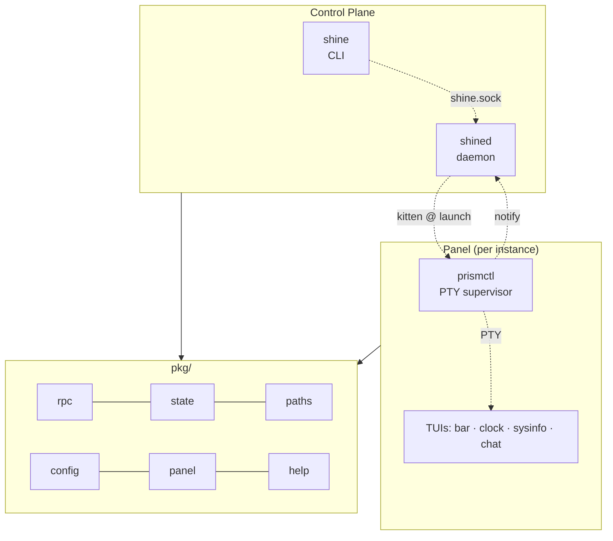
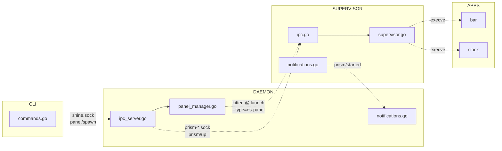
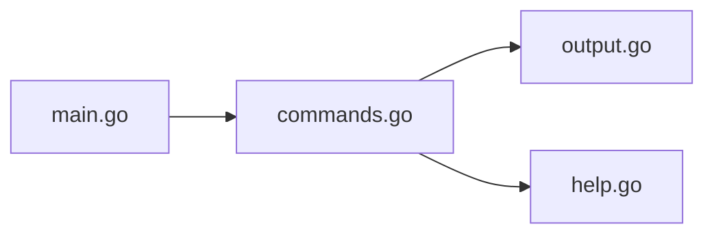
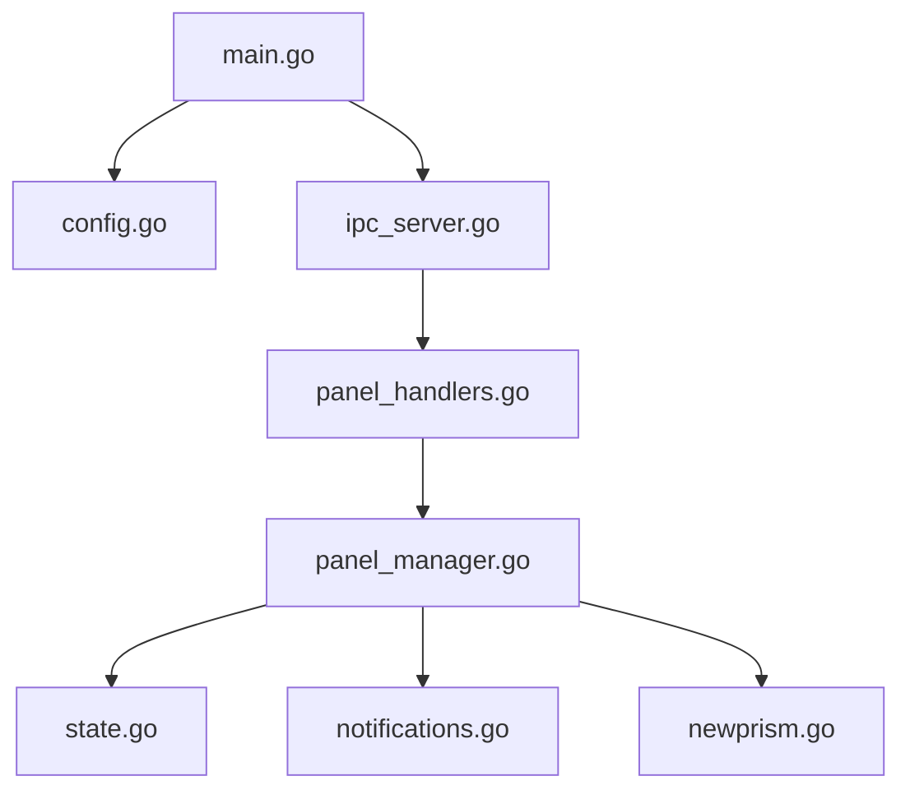
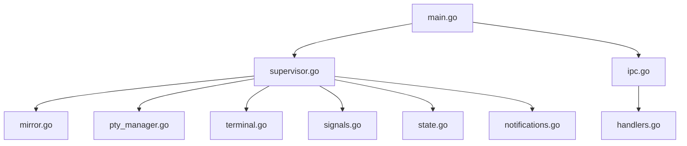
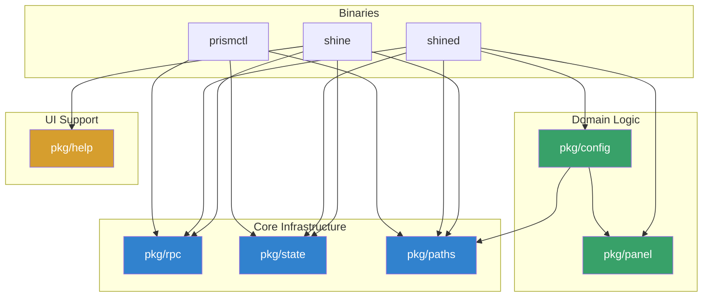

# SHINE Architecture

## Diagram Conventions

| Arrow | Meaning |
|-------|---------|
| `-->` | Compile-time import |
| `-.->` | Runtime IPC |

## System Overview

Commands flow **down**, notifications flow **up**.

## Runtime Communication

Detailed IPC flow showing socket-level interactions.

## Binary Structure

Each binary's internal file organization.

### cmd/shine/ (CLI)

### cmd/shined/ (Daemon)

### cmd/prismctl/ (PTY Supervisor)

## Package Dependencies

How `pkg/` modules relate to each other and to binaries.

## File Inventory

| Directory | Files | Role |
|-----------|------:|------|
| `cmd/shine/` | 4 | User CLI |
| `cmd/shined/` | 9 | Service daemon |
| `cmd/prismctl/` | 12 | PTY supervisor |
| `cmd/prisms/` | 4 | Example TUIs |
| `pkg/config/` | 5 | Config & discovery |
| `pkg/panel/` | 2 | Kitty integration |
| `pkg/rpc/` | 4 | JSON-RPC 2.0 |
| `pkg/state/` | 4 | Mmap state files |
| `pkg/paths/` | 1 | Path utilities |
| `pkg/help/` | 2 | Help rendering |
| **Total** | **37** | |
